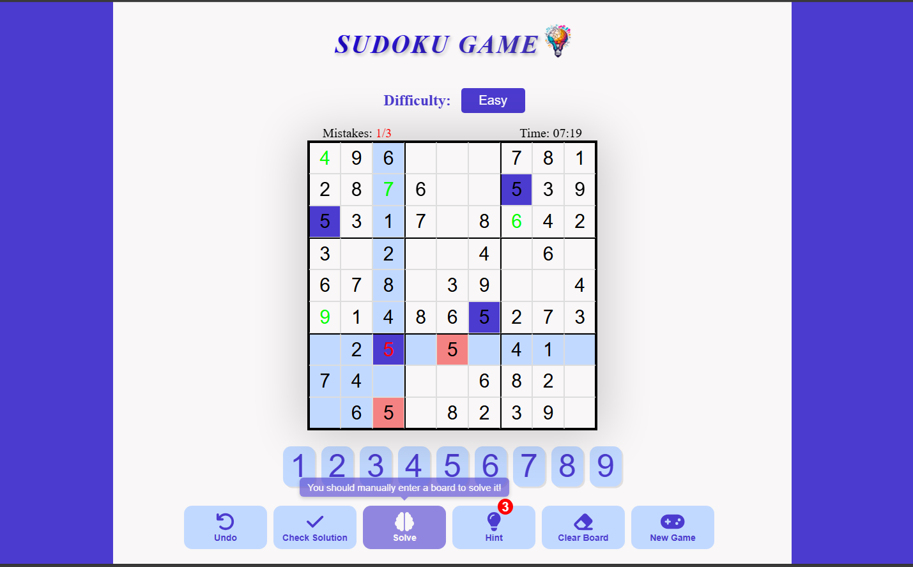
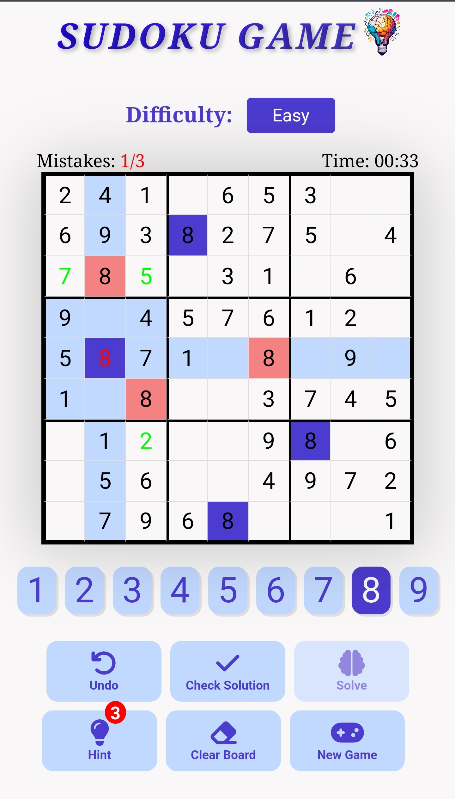

# udoku Game in React TypeScript
This is a fully functional Sudoku game built with React and TypeScript. The game allows players to interact with a Sudoku grid, enter numbers, and receive real-time feedback on the validity of their entries. It includes features such as conflict detection, undo functionality, and win/lose conditions. 

- check it by pressing in the following link: [click-me](https://sudoku-game-1133.netlify.app/)

## ScreenShots (PC Version & Mobile Version)

  
  

## Features:
- Interactive Grid: Players can select cells, input numbers, and see immediate validation of their entries.
- Conflict Detection: The game highlights conflicting numbers in rows, columns, and subgrids, helping players avoid mistakes.
- Undo Functionality: Players can undo their last action and revert to the previous grid state.
- Game Over and Win: The game tracks the number of mistakes and displays a "game over" screen once the maximum number of mistakes is reached. If the player wins, a victory screen is shown.
- Read-Only Cells: Some cells are read-only, and players are unable to modify these pre-filled values.
- Responsive Design: The game layout adapts to different screen sizes for a smooth playing experience on both desktop and mobile devices.
## How to Play:
- Select a cell to focus on.
- Enter a number from 1 to 9.
- The game will validate your entry and highlight any conflicts.
- If you reach the maximum allowed mistakes, the game will end, and you will see a "game over" screen.
- You can undo your last action if needed.
- Once you solve the puzzle, a "victory" screen will be shown.
